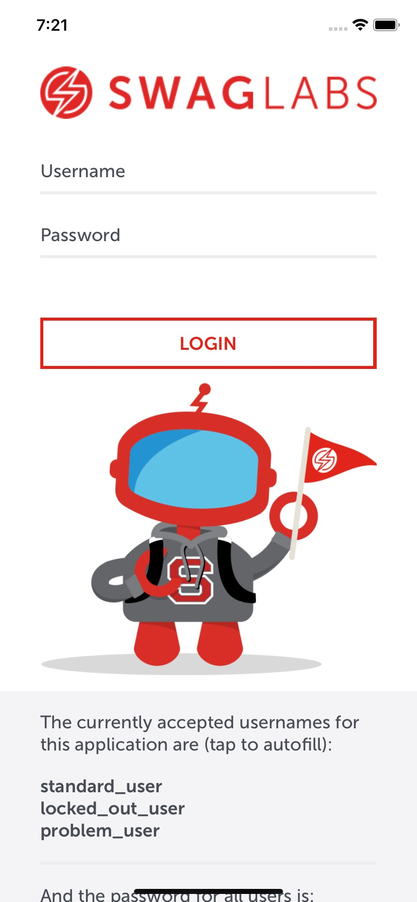
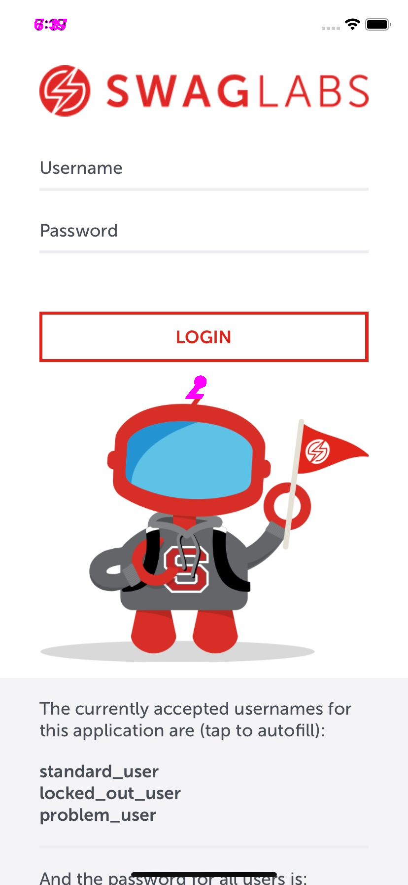

# **codeceptjs-native-web-POC**
This project is a proof of concept implementation of using codeceptJS for performing functional (UI) testing of native apps on android and iOS using Appium, and also testing of web apps via [**Playwright**](https://playwright.dev/).

CodeceptJS (https://codecept.io/) is a platform agnostic testing framework that can automate testing against web apps, hybrid apps, and native mobile apps. It can also execute tests against simulators, real devices, and via cloud based device providers such as SauceLabs, Browserstack, and Perfecto.  

The syntax of tests for codeceptJS is extremely simple and approachable, and is consistent across testing targets, e.g. the same test syntax is used to test everything from web to native apps, which means that a person learning to write tests for one platform can easily transport their skills for testing against another.

**Note:** This project is specifically intended to enable both **iOS** and **Android** native applications.  As such, the install instructions from this point forward are Mac specific, since a Mac is required in order to test the iOS apps.  If you wish only to utilize the web portion of the test suite, or if you are only going to use cloud services, you may omit the steps for installing XCode or Android Studio as desired.  If you would prefer a windows machine, you may do so; only the iOS specific portions of this project would be unavailable.

## **Things this Project Does**

This project provides a number of features, including the following:

- Android native app testing
- iOS native app testing
- Web application testing
- Reporting via XML
- Reporting via HTML
- Reporting via JSON
- Reporting integration with the Allure reporting dashboard
- Visual testing (comparing views at run-time with a baseline image representing design)
- Automatic screen-shots on failed tests
- Simple JS based tests with an approachable syntax
- BDD style testing via Cucumber and Gherkin features
- Universal features; one set of BDD features to drive testing across both Android and iOS
- Universal step definitions; 'one and done' feature steps that can execute against android or iOS
- Local simulator testing
- Local browser testing
- Cloud device testing via Perfecto

## **Getting Started**

### **Nerd Note**

This readme is written with n00bs in mind.  As a result, it exhaustively covers setup including all necessary dependencies.  It assumes zero preparation, so includes steps for doing things like:

- Installing homebrew
- Installing node and npm
- Installing java
- Installing xcode
- Installing and setting up Android Studio
- Installing appium
- Setting environment variables

Feel free to skip any steps you have already satisfied, but please recognize that unless all of them are satisfied, this project will not successfully execute tests.

### **Install Homebrew**

Before installing, you need to have node installed on your system.  For macs, this can be most easily accomplished using homebrew.  If you don't have homebrew installed on your system, you may do so by pasting this into terminal:

```
/bin/bash -c "$(curl -fsSL https://raw.githubusercontent.com/Homebrew/install/HEAD/install.sh)"
```

### **Install Node and NPM**

Once you have installed brew, you can install node.  To do so, make sure brew is updated to the latest by typing the following command in terminal:

```
brew update
```

Then type the following into terminal in order to install node:

```
brew install node@14
```

**IMPORTANT!:** You must use the LTS (long term support) version of node, which as of this writing is 14.17.6; this project ***will not work*** with later node versions.  If you have a newer version of node installed, then you must use node version manager (nvm) to install node 14 and use it.  A concise guide on how to do so may be found here: https://chamikakasun.medium.com/how-to-manage-multiple-node-versions-in-macos-2021-guide-5065f32cb63b

When the process completes, you can test node and NPM by typing the following commands into terminal:

```
node -v
```
```
npm -v
```

Having done this, you should see version strings for each in response to the command entered.

### **Install Java**

This project requires java.  You will need to install the JDK by downloading it from https://www.oracle.com/java/technologies/javase-downloads.html. It is a good idea for you to use the latest version for your platform.  Note that to make this easier, it is a good idea on macs to download the .dmg instead of the .gz archive.

Once you have downloaded the JDK, you can install it on a mac by double-clicking the .dmg and then following the prompts.

### **Install Xcode**

To test iOS apps using this project, you will need to install Xcode on your mac.  You may do so through the Apple App Store.  You may skip this step if you don't wish to test iOS applications.

**Note:** It is extremely important to ensure that the proper path for xcode is available to the Appium instance when it runs.  For a standard installation, you can manage this by typing the following in terminal:

```
sudo xcode-select --switch /Applications/Xcode.app
```

This will set the path to Applications.  If you install xcode in a non-standard location, you will need to adjust the above noted path as needed.

### **Install Android Studio**

To test Android apps, you will need to install Android Studio.  You may do so by downloading the proper version for your machine from https://developer.android.com/studio, and then following the installation instructions available at https://developer.android.com/studio/install.

### **Create an Android Virtual Device**

In order to run tests on Android, you will want to create an android emulator device using Android Studio's AVD manager.  To do so, launch Android Studio and then click the '**New Project**' button:


**Note** that you are only creating this project so that you may gain access to the AVD manager; you may choose any type for phone and tablet, as follows:


Once you have created your new project, it will open, giving you access to define a new AVD.  To do so, select '**Tools > AVD Manager**' from the tools menu as seen below:


This will launch the AVD manager, allowing you to create a new Android Emulator.  To do so, click the '**Create Virtual Device**' button, then select '**Phone**' and '**Pixel 5**' on the following screen, as seen below.  After making these selections, click '**Next**.'


After clicking '**Next**', you should see a screen allowing you to set the OS version that will be installed on the virtual device.  **IMPORTANT**: You must select '**Pie**', which has an API level of '**28**', as seen below.  **Note** that if you have never created an AVD, you may need to download the specific SDK to your computer.  To do so, click the '**Download**' button immediately to the right of '**Pie**.'  Then click '**next**.'


After clicking '**Next**' on the previous screen, you should see a screen allowing you to set the name of the AVD you are creating, as seen below.  **IMPORTANT**: you **must** name your AVD '**Pixel 5 API 28**.'  This is because the configurations in this project are somewhat limited, and do not provide the ability to choose different devices at run-time.  That capability will be added at a later time.  The point is that the device must be named this way because that is what the configuration expects.  If you choose a different name, these tests **will not work.**  Once you have provided the name, click '**Next**.'


Now that you have defined an AVD, you should see it in the AVD manager's list of existing AVDs, as seen below.  If you wish, you may launch the AVD by clicking the green play icon (a rightward facing triangle) near the right side of the list entry for a given AVD.


### **Install Appium Doctor & Appium**

In order to use codeceptJS to test mobile apps, you will need appium. Appium is a nodeJS based automation server which will orchestrate the execution of tests against native applications running on simulators, physical devices, and physical devices in the cloud.  To install it, enter the following commands at a mac terminal prompt:

```
npm i -g appium-doctor
```
```
npm i -g appium
```

This will install appium-doctor and Appium.  **Note** that appium doctor is a utility that can be used to verify your Appium installation.  Once you have completed the rest of the steps in this guide, run it from terminal by typing the following at the prompt:

```
appium-doctor
```

**Note** that it is a good idea to install the Appium desktop app if you will be needing to identify element selectors (the selectors utilized to target specific elements in the UI) by inspecting an app directly (see the section '**Using Appium Viewer** later in this guide).  You can do so by downloading the installer at https://appium.io/, and following the installation instructions.

### **Install Allure**

Allure is an open source reporting framework that can produce beautiful, detailed reports.  This project requires you to install allure, and you may do so by entering the following into terminal:

```
npm install -g allure-commandline --save-dev
```

### **Set Environment Variables**

You must set the JAVA_HOME, ANDROID_HOME, and ANDROID_SDK_ROOT environment variables, otherwise tests will not run.  You may do so by entering the following in terminal:

```
open ~/.bash_profile
```

This will open your bash profile using Textedit, and from there you can add the following to your profile:

```
export JAVA_HOME=/Library/Java/JavaVirtualMachines/<your installed JDK version>/Contents/Home

echo JAVA_HOME=$JAVA_HOME

export ANDROID_HOME=/Users/<your user name>/Library/Android/sdk

export ANDROID_SDK_ROOT=/Users/<your user name>/Library/Android/sdk
```

**Note** that you should replace the java SDK version in JAVA_HOME with whatever version you downloaded, and you should specify your username in the ANDROID_HOME and ANDROID_SDK_ROOT strings.  For example, I have specified '**jdk1.8.0_301.jdk**' for the JDK version, and '**thomastupper**' for the user name, since these are what these values are on my machine.  You will need to adjust these based on whatever is correct for your machine.

Once you have entered the required values into your bash profile via Textedit, save the file and close it, then enter the following command into terminal:

```
source ~/.bash_profile
```

This will reload your profile.  You can verify a successful update by typing the following in terminal:

```
echo $JAVA_HOME
```

Having done so, you should see whatever it is that you entered for JAVA_HOME displayed in terminal.

### **Clone the Repo**

Having completed all of the foregoing steps, it is time to clone the repo.  To do so, type the following in terminal:

```
git clone https://github.com/ttupper92618/codeceptjs-native-web-POC.git
```

**Note** that you should only do this from the location where you want this project to be installed.  It is recommended that you install it at the root of **users/your username**.

### **Install Dependencies**

This project has a number of dependencies.  You must install these before you can execute tests.  To do so, first CD into the cloned repo:

```
cd codeceptjs-native-web-POC
```

Then execute the following:

```
npm i
```

### Sanity Check

Now that you have finished all the requisite configuration, run appium-doctor to see if your installation is correct.  Correct any errors that appium doctor reveals; you do not need to correct the warnings.

```
appium-doctor
```

### Running Appium

Before you can execute tests, you need to run Appium.  You may do so either by typing the following from terminal:

```
appium
```

Or by opening the desktop application and cliking the '**Start Server v...**' button from the desktop app:


It is recommended that you launch the desktop app, as this will give you access to Appium Inspector, allowing you to identify the locators for interactive elements.

### **Executing Tests**

If you have successfully executed all of the previous steps, you should now be able to execute tests.  At this time, this project does not support executing Android and iOS tests in parallel.  Instead, you must execute for one or the other using one of these commands in terminal:

For iOS:
```
npm run ios
```

For Android:
```
npm run android
```

For Web:
```
npm run web
```

For iOS via Perfecto:
```
npm run ios-perfecto
```

For Android via Perfecto:
```
npm run android-perfecto
```

Note that you must execute these from within the '**codeceptjs-native-web-POC**' directory.

If you watch your screen, having executed one of the above commands, you should be able to see the iOS or Android simulator spin up, and you should be able to watch the tests execute in real time.  When the tests complete running, you should see an execution summary in your terminal:


### **Reporting**

One of codeceptJS's numerous capabilities is the ability to do flexible reporting.  One of these reporting mechanisms is integration with Allure, an open source reporting dashboard that provides graphical, easy to use reports.  To view reports using allure, execute the following from your terminal:

```
allure serve output
```

Having done so, you should see allure open in your default web browser, as seen below.  Feel free to navigate around Allure's sections - there are too many great features to cover here.


In addition to allure, this project will also produce XML and JSON reports for each test case, and also produces an HTML report.  The XML reports are located in the '**output**' directory within the project, and the HTML and JSON reports (see the HTML example below) can be found in the '**mochawesome-report**' directory.


### **Visual Testing**

This project enables visual testing through resemble.js.  Resemble.js is an image comparison tool that can compare two images and produce a diff image that highlights the differences between the two images. It can be configured to ignore differences under a given threshold, and when tests fail, the base, capture, and diff images are provided through this project's reporting processes.  You can include visual testing in any test case simply by taking a screen capture and then comparing it to a base image, like so:

```
I.saveScreenshot('login_view.png');
I.seeVisualDiff('login_view.png', {tolerance: 0});
```

To see how this works, one of the sample tests in this project will intentionally fail.  Based on the following base image, it will capture the login view, and produce a diff as seen below:

| Base Image            | Screen Capture        | Diff                  |
| --------------------- | --------------------- | --------------------- |
|  |  |  |

Notice how the diff image highlights (in magenta) the areas that differ between the base and capture images.

## **Perfecto**

In addition to simulator testing, this POC is capable of executing tests against real devices using Perfecto cloud.  To do so, you may execute tests against either ios or android using one of the following commands via terminal:

```
npm run ios-perfecto
```

```
npm run android-perfecto
```

This will run against either Android or iOS in the Perfecto cloud by consuming the appropriate config file.  These files are located in the configurations folder of the project:


**Please note** that executing tests using perfecto requires a perfecto slug and key; the values within this POC for host, securityToken, and user need to be changed in the ios and android perfecto configurations so as to reflect those values which are appropriate for your Perfecto license.  The values in this POC are for a Perfecto trial and it will eventually expire.

## **Notes on Writing Tests**

The test syntax of codeceptJS is approachable and simple; test runs revolve around the "I" method and its children.  These simple methods can be used to find elements, fill fields, click or tap elements, perform swipe gestures, and much more. For example, the method "I.click(<locator>)" would click the element specified by the given locator on a web page.  I.tap would perform the equivalent operation for a native mobile app.

Example tests are provided in this POC to perform basic operations against the sample-app (included), and documentation concerning all of the available "I" methods can be found [here](https://codecept.io/helpers/Appium.html#methods).  Below you can see a sample test condition.


**Note** that it is important to understand that some methods are specific to native testing, and others are not.  In most cases, the documentation linked above will specify if a method is Appium specific, and what platforms (iOS or Android) it can serve.  In general, if the method is not noted as being restricted to a native device, then it will work on web as well.  But take care: there are methods like **"click"** which are meant for use on web, but on mobile the native app specific method for the same purpose is **"tap"**.  You should exercise care to ensure that if there is a native specific method that accomplishes the same purpose as a more general method, you should use the one specific to native applications when writing tests for those applications.  In most cases, either will work but in some, as is the case with **"tap"** and **"click"**, they are not interchangeable and will not work in the wrong testing context.

## **Differing Modes of Operation**

This POC demonstrates two different approaches to testing.  The approach you choose is largely up to your preference and the needs of your testing workflow.

### **Isolation Testing**

In a general sense, this POC demonstrates what may be thought of as "isolation testing" and "unified testing".  Isolation Testing may be understood as "having separate test cases for both IOS and Android".  In this approach, you can have different test cases for your android application vs. your iOS application.  Advantages to this approach include increased flexibility and the ability to tailor test cases explicitly.  Disadvantages include the increased complexity that arises from having to manage what is essentially two different testing libraries.

Sample tests for this approach can be seen in the "iOS" and "android" folders:


### **Unified Testing**

In contrast to isolation testing, unified testing leverages a single set of universal test cases that can target both iOS and android devices from the same scenarios or BDD steps.  This dramatically reduces test duplication and can lead to a cleaner and more easily maintained test suite.  In this POC, unified test examples can be found in the "universal-tests"  and "universal-steps" folders, for direct and BDD style tests, respectively.


### **Special Note on Web Testing**

Although it is possible to combine tests for iOS and Android into a universal test suite through the use of the **I.runOnIOS** and **I.runOnAndroid** wrappers, this is not possible for web testing at this time because there is not a device agnostic wrapper for web.  **Note** that there *is* an **I.runOnWeb** method, but it is only applicable when running web tests on a mobile device or simulator; It will not execute tests in a browser outside of that context.  The general rule to understand here is this: for the reasons stated above, when writing tests for web browsers, those tests must be separate and must be placed in the "web" folder, as this is where the web configuration will look for them.  If you are using BDD, then the features and steps must likewise be within the web folder, as seen below:


## **BDD with Gherkin**

This POC demonstrates BDD (behavior driven development) style testing through the specification of features with Gherkin, and steps constructed using the same syntax used with non-BDD style testing.  The difference is that test execution is driven first by the natural-language feature specification, each element of which has an accompanying step which is executed when a given clause in the feature specification is reached.  As an example, consider the following feature and how it's clauses map directly to steps:


## **Obtaining Locators**

When writing tests, it will be necessary to have locators for the elements the test needs to interact with.  In the simple cases of web applications, these can be obtained by using a web inspector such as Chrome DevTools to inspect the markup of the application.  In many cases, a simple element ID is sufficient.  In cases where no ID is present, a CSS class or other data attribute may be used.  And some elements can be identified merely through their text strings.

In the case of native mobile apps, things get somewhat more complex.  It is necessary to use an inspector to examine the application.  Fortunately, Appium bundles an inspector, and what follows is a brief tutorial on how to use Appium Inspector to identify element locators for Android and iOS native apps.

### **Launching Appium Inspector**

In order for you to identify locators, you will need to have installed Appium Desktop by following the Appium installation instructions found earlier in this document.  Once you have Appium desktop installed, the process of launching the inspector is relatively straightforward.  First, launch Appium desktop, and click the blue "Start server" button as seen below:


Having done so, you will see the Appium server spin up, and give you a console like display, as seen below:


Click on the magnifying glass icon highlited in the picture above.  This will cause the Appium inspector to spin up, as seen below.  It is here where configuration will become more complex.


In order for you to use inspector on an actual app, you must provide what are known as "capabilities".  Appium server uses these to spin up and expose the locators of a given application.  In order for this to be as painless as possible, I am providing the capabilities you will need for both the sample Android and iOS apps.  These will work assuming you have cloned the repo into the root of your user on a mac, e.g. **users/your user name**.  If you change the location in which you clone the repo e.g. you do not do so into users/your user... then you will have to identify the correct path to the **sample_apps** directory.  In any case, the capabilities that will work given the default structure are as follows:

**Android:**

```
{
  "platformName": "Android",
  "app": "/Users/<your username>/appium-codecept-POC/sample_apps/Android.apk",
  "avd": "Pixel_5_API_28",
  "automationName": "UiAutomator2",
  "deviceName": "Pixel 5 API 28",
  "appActivity": "com.swaglabsmobileapp.MainActivity"
}
```

**iOS**

```
{
  "platformName": "iOS",
  "app": "/Users/<your username>/appium-codecept-POC/sample_apps/iOS.app",
  "automationName": "XCUITest",
  "deviceName": "iPhone 11",
  "resign": true
}
```

You should click the edit icon in the Appium inspector, found within the "JSON Representation" block, and copy and paste the capabilities you want, as seen here:


Having done so, click on the "Start Session" button.  This will launch the app in the simulator, and eventually you should see a window that looks like the image below:


On the left of this image, you can see a representation of the app.  You may click on the various elements of the app and you will see the possible selectors appear on the right.  In most cases for the native apps, you will want to use either the accessibility id or the xpath.  You can also select certain elements by just their text string.  You can copy and paste these values into your tests for operations such as "I.tap", e.g.:

```
I.tap('//XCUIElementTypeTextField[@name="test-Username"]');
```

You can directly interact with the app by using the 'Tap' and 'Send Keys' buttons, which will behave as if you have performed that action in the running app.  You can also perform actions directly in the running app, such as logging in or navigating to other sections, and you may refresh the view in Appium Inspector by clicking the refresh icon in the top toolbar.

### **Locator Notes**

There are many ways to locate elements, ranging from xpath to simple text.  What you should use will be based on the application.  In general, you should work to have your dev teams add accessibility ids to interactive elements.  This is because accessibility ids are less likely to change than xpath locators, and they are also faster.  For web, you will want to use ids, class names, etc.

For more information about locators and what you can and cannot do using this framework, read the locator documentation found here:  https://codecept.io/locators/

## **Architecture** 

For those readers nerdy enough to want an architectural rendering of how this solution works, here is a chart:


## **Roadmap**

This POC will be extended in the following manner some time soon:

- Integration with ReportPortal.io, an open source containerized report aggregator allowing report aggregation from test runs across different platforms, e.g. web, ios native, android native, and so on.

- Multi-target execution; being able to run tests against multiple devices and platforms at the same time.

- Better abstraction of run strings, allowing test runs to be made flexibly with different features enabled / disabled.

- Expanded visual testing support.

- Better set-up and tear-down handling.

## **Known Issues**

- This project executes tests against android applications using uiautomator, the native ui automation tool provided by Google.  The appium community variant (uiautomator2) will not work with this project.

- Visual testing does not properly handle differences between devices or device platforms, which makes the implementation more restrictive and brittle than desired.
